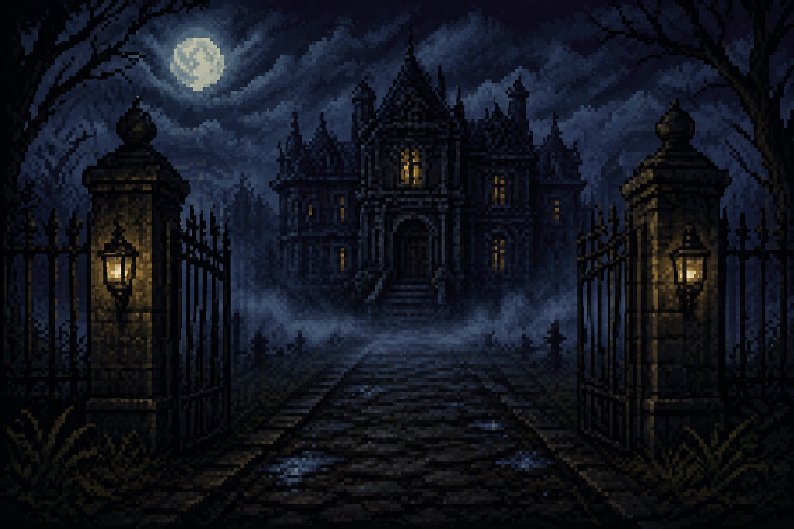

```md id="k7s2px"
# 🏚️ LA MANSIÓN DEL ECO 🕯️

<p align="center">
  
</p>

<p align="center">
Un juego de horror, misterio e investigación estilo pixelart.<br>
Descubre al asesino antes de que la mansión reclame otra víctima.
</p>

---

# 👤 Autor

### Rodrigo Lagos Navarro  
### 23110148  
### 7E

---

# 🎮 Descripción

**La Mansión del Eco** es un juego de horror pixelart donde cada partida genera aleatoriamente:

- 🔪 Un asesino
- 🩸 Un arma
- 🏚️ Una habitación del crimen
- ☠️ Una víctima

El jugador deberá:

✔️ Explorar habitaciones  
✔️ Hablar con personajes  
✔️ Descubrir cadáveres  
✔️ Encontrar pistas  
✔️ Realizar acusaciones  

Pero cuidado...

⚠️ Cada acusación incorrecta provocará otra muerte.

---

# 🕹️ Características

✨ Sistema de asesinatos aleatorios  
🕯️ Horror paranormal  
🎨 Estilo pixelart oscuro  
🧩 Investigación y deducción  
👻 Ambiente inspirado en novelas visuales de terror  
☠️ Múltiples víctimas  
🔄 Partidas diferentes cada vez  

---

# 🗺️ Habitaciones

- 📚 Biblioteca
- 🕳️ Sótano
- 🛏️ Habitación
- 🍽️ Comedor
- ⛪ Capilla

---

# 🔪 Armas

- Daga
- Crucifijo
- Hacha
- Cuerda
- Vela

---

# 🖱️ Controles

| Acción | Control |
|---|---|
| Interactuar | Click Izquierdo |
| Explorar | Botón IR |
| Acusar | Botón ACUSAR |

---

# 📸 Capturas

## Menú principal

<p align="center">
  
</p>

---

# ⚙️ Tecnologías utilizadas

- HTML5
- CSS3
- JavaScript

---

# 🚀 Cómo ejecutar

1. Descargar el proyecto
2. Abrir `index.html`
3. Jugar

---

# 🌑 Inspiración

Inspirado en:

- Horror psicológico
- Novelas visuales
- Juegos retro pixelart
- Misterio paranormal

---

# ☠️ Advertencia

La mansión siempre exige otra víctima...

---

# 📌 Estado del proyecto

✅ Funcional  
✅ Sistema de investigación  
✅ Muertes aleatorias  
✅ Sistema de acusaciones  
✅ Tutorial integrado  

---

# 🩸 Hecho por

## Rodrigo Lagos Navarro
## 23110148 — 7E
```
